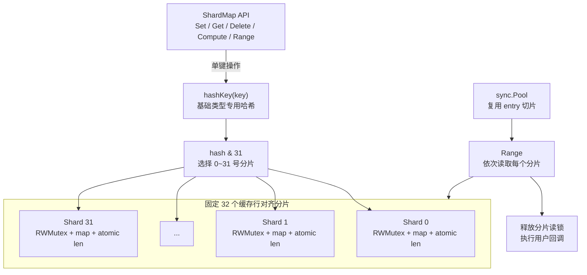

# shard-map

`shard-map` 是一个基于 Go 泛型实现的并发安全分片 Map。它将键固定路由到 32 个独立分片，在保留静态类型、零值可用和常用原子操作的同时，减少单锁 Map 在并发读写时的锁竞争。

适合内存缓存、会话状态、计数器等需要类型安全和稳定读写延迟的场景。它不是 `sync.Map` 的通用替代品；两者适用的访问模式不同，选择建议和实测结果见[与 sync.Map 对比](#与-syncmap-对比)。

## 特性

- 固定 32 个分片，每个分片使用独立的 `sync.RWMutex`。
- 泛型 API，无需在业务代码中进行类型断言。
- 零值可直接使用，内部 Map 按第一次写入延迟初始化。
- 提供 `LoadOrStore`、`LoadOrCompute`、`Compute` 和 `Swap` 等原子单键操作。
- 每个分片维护原子长度，`Len` 无需获取分片锁。
- `Range` 逐分片复制数据，并在释放读锁后执行回调。
- 支持与 Go 相等语义一致的基础类型哈希，包括浮点数的 `+0`/`-0`。

## 安装

```bash
go get github.com/451008604/shard-map
```

要求 Go 1.21 或更高版本。

## 快速开始

```go
package main

import (
	"fmt"

	shardmap "github.com/451008604/shard-map"
)

func main() {
	// 零值可直接使用，也可以调用 NewShardMap[string, int]()。
	var counters shardmap.ShardMap[string, int]

	counters.Set("requests", 1)
	counters.Compute("requests", func(old int, loaded bool) int {
		if !loaded {
			return 1
		}
		return old + 1
	})

	if value, ok := counters.Get("requests"); ok {
		fmt.Println(value) // 2
	}

	counters.Range(func(key string, value int) bool {
		fmt.Printf("%s=%d\n", key, value)
		return true
	})
}
```

## 架构设计



### 核心设计

| 设计 | 实现与取舍 |
| --- | --- |
| 分片路由 | `hashKey(key) & 31` 代替取模；分片数在编译期保证为 2 的幂。 |
| 锁粒度 | 单键操作只锁定一个分片，不同分片可并行；同一热点分片内仍会竞争。 |
| 缓存行 | 分片结构填充到 64 字节，降低相邻分片原子计数与锁状态的伪共享。 |
| 长度统计 | 插入和删除时更新分片 `atomic.Int64`；`Len` 汇总 32 个计数。并发写入期间结果不是全局一致快照。 |
| 遍历 | `Range` 在读锁内复制一个分片，在锁外回调；因此长回调不会持续阻塞写入，但遍历不是全局一致快照。 |
| 回调原子性 | `Compute` 在分片写锁内执行回调以保证读-改-写原子；`LoadOrCompute` 在锁外计算以允许重入，但竞争时可能重复计算。 |

## 键类型

`Key` 支持以下内建类型：

```text
bool, string,
int, int8, int16, int32, int64,
uint, uint8, uint16, uint32, uint64, uintptr,
float32, float64, complex64, complex128
```

结构体、指针、接口，以及定义的新类型不能作为键：

```go
type UserID string  // 不支持：这是定义的新类型
type UserAlias = string // 支持：这是 string 的别名
```

浮点数和复数遵循 Go 的键比较规则。特别地，`+0` 与 `-0` 会得到相同哈希。与原生 Map 一样，不建议使用 `NaN` 作为需要再次查找的键，因为 `NaN != NaN`。

## API 与并发语义

| 方法 | 语义 |
| --- | --- |
| `NewShardMap[K, V]()` | 创建空 Map；也可以直接使用 `ShardMap` 零值。 |
| `Set(key, value)` | 写入或覆盖单个键。 |
| `Get(key)` | 返回值和存在标志。 |
| `Delete(key)` | 删除键；键不存在时无操作。 |
| `LoadOrStore(key, value)` | 已存在则返回原值，否则原子写入给定值。 |
| `LoadOrCompute(key, fn)` | 已存在则返回原值，否则在锁外计算。竞争时 `fn` 可能执行多次，但只存储一个结果。 |
| `Compute(key, fn)` | 在分片写锁内完成原子读-改-写。`fn` 不得重入访问同一 Map 中落到相同分片的方法。 |
| `Swap(key, value)` | 原子替换值并返回旧值和存在标志。 |
| `Len()` | 无锁汇总分片计数；并发修改时不是全局一致快照。 |
| `Range(fn)` | 逐分片快照遍历；返回 `false` 可提前停止，不保证遍历期间的全局一致性或顺序。 |

## 与 `sync.Map` 对比

### 如何选择

| 需求或访问模式 | 建议 |
| --- | --- |
| 需要泛型类型安全、`Len`、`Compute`，或明确的单键读-改-写 API | `ShardMap` |
| 键和值类型不固定，或已有代码直接依赖标准库 API | `sync.Map` |
| 大量新增键，关注写入分配和静态类型 | 先测试 `ShardMap` |
| 键集合长期稳定、读多写少，或多个 goroutine 主要访问不同键 | 先测试 `sync.Map` |
| 热点集中在少数键或少数分片 | 两者都应使用真实 workload 压测；分片不能消除热点竞争 |

`sync.Map` 的文档定位是特定并发访问模式下的优化实现；`ShardMap` 则通过固定分片提供更直接、可预测的锁模型。不要只根据类型名称选型，应使用接近生产环境的键数量、读写比例和热点分布进行基准测试。

### 基准方法

仓库中的 `benchmark_test.go` 使用相同的 `int` 键和值、相同键序列和相同 worker 数对比两者：

- 单线程 `Set` 持续插入新键，`Get` 在 10,000 个预填充键中命中，`Delete` 删除预填充键。
- 并发写在固定 10,000 个键上反复覆盖；并发读全部命中。
- 混合负载使用 256 个 worker，按确定性序列产生 0%、10%、50% 和 100% 写入。
- `Range` 对预填充的 100、1,000 和 10,000 个键完成全量遍历。

复现命令：

```bash
go test -run '^$' \
  -bench='(ShardMap|SyncMap)' \
  -benchmem -benchtime=300ms -count=5 ./...
```

### 本机结果

以下结果采集于 2026-07-21：Go 1.24.13、Darwin/arm64、Apple M1 Pro、默认 `GOMAXPROCS=10`。表中为 5 次运行的 `ns/op` 中位数，越低越好；它表示该并行 workload 的单位操作吞吐成本，不等同于单次请求延迟。

单线程操作：

| 操作 | `ShardMap` | `sync.Map` | 结果 |
| --- | ---: | ---: | --- |
| 新键 `Set` | 127.5 | 353.4 | `ShardMap` 约 2.77x |
| 命中 `Get` | 12.76 | 20.18 | `ShardMap` 约 1.58x |
| `Delete` | 184.3 | 284.0 | `ShardMap` 约 1.54x |

并发覆盖写（固定 10,000 个键）：

| Worker | `ShardMap` | `sync.Map` | 较快者 |
| ---: | ---: | ---: | --- |
| 1 | 23.99 | 99.08 | `ShardMap` 4.13x |
| 4 | 38.00 | 58.89 | `ShardMap` 1.55x |
| 16 | 61.59 | 42.85 | `sync.Map` 1.44x |
| 64 | 64.68 | 45.64 | `sync.Map` 1.42x |
| 256 | 67.19 | 49.13 | `sync.Map` 1.37x |
| 1024 | 65.28 | 51.67 | `sync.Map` 1.26x |

256 worker 混合负载：

| 写比例 | `ShardMap` | `sync.Map` |
| ---: | ---: | ---: |
| 0% | 19.44 | 3.506 |
| 10% | 52.47 | 10.03 |
| 50% | 74.85 | 30.70 |
| 100% | 69.21 | 55.85 |

这些结果表明本机上的交叉点很明确：`ShardMap` 在单 worker 和新增/删除路径占优；当前 Go 版本的 `sync.Map` 在稳定键集合的高并发读与覆盖写中更有优势。另一方面，并发覆盖写时 `ShardMap` 为 `0 B/op, 0 allocs/op`，而 `sync.Map` 约为 `63 B/op, 2 allocs/op`，吞吐与分配需要结合应用的 GC 预算一起评估。

`Range` 不应只比较数字：`ShardMap` 会复制每个分片后在锁外回调，`sync.Map.Range` 直接遍历内部状态，两者提供的锁持有行为和遍历成本不同。本次 10,000 键结果分别约为 89.6 µs/op 和 194.7 µs/op，但键数较小时 `sync.Map` 更快，实际交叉点会随值大小和回调成本变化。

上述数据只是一次可复现的本地快照，不能替代目标硬件、目标 Go 版本和真实键分布上的测量。

## 开发与验证

```bash
gofmt -w *.go
go test ./...
go test -race ./...
go vet ./...
go test -bench=. -benchmem ./...
```

仓库还包含并发、支持键类型、哈希回归和模糊测试。修改哈希、锁、原子计数或 `Range` 时，应至少运行完整测试和 race detector。

## 许可证

[MIT](LICENSE)
